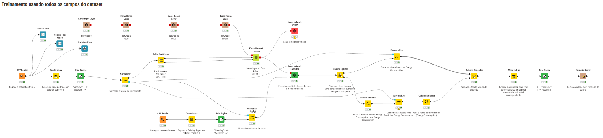
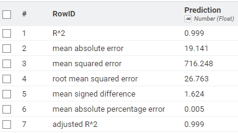
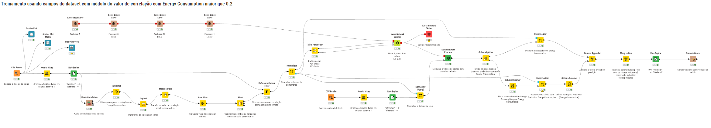
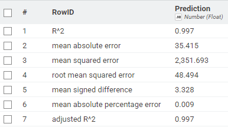

# Projeto Final — Energy Consumption Dataset (Linear Regression)

**Rafael Lindoso de Araujo** — rla2@cesar.school  
**Rodrigo Borba** — rsb7@cesar.school  

Dataset utilizado:  
Energy Consumption Dataset - Linear Regression  
https://www.kaggle.com/datasets/govindaramsriram/energy-consumption-dataset-linear-regression

---

## Workflow

### Treinamento usando todos os campos do dataset

#### Resultados

Os resultados utilizando todos os campos do dataset resultaram em um modelo com assertividade bem alta (**R² = 0.999**).

Para chegar nesse resultado, utilizamos três neurônios com 8 e 16 camadas ReLU e uma camada linear.  
Para o treinamento, a função de perda utilizada foi o erro quadrático médio (MSE) e o otimizador foi o Adam com Learning Rate (LR) 0.01.

Inicialmente utilizamos LR = 0.001, que retornou um ótimo resultado (**R² = 0.978**).  
Mesmo assim, exploramos um pouco mais e chegamos a um resultado melhor utilizando LR = 0.01.

Apesar do R² elevado, é importante observar se há diferença entre treino e validação, pois o uso de todas as variáveis pode aumentar o risco de overfitting.

---

### Treinamento com campos com correlação maior que 0.2

#### Resultados

Para chegar nesse resultado, utilizamos o nó **Linear Correlation** e eliminamos as colunas:

- temperatura média  
- dia da semana  
- comercial (derivada do campo tipo de construção)

As colunas removidas apresentaram baixa correlação com a variável alvo, indicando menor contribuição para o modelo.

O mesmo esquema de neurônios foi utilizado. Houve pequena redução (≈0,2%) no R² (**0.997**), considerada pouco relevante frente à simplificação do modelo.

Como utilizamos menos campos para treinar, o treinamento foi um pouco mais rápido e a perda de performance foi pequena.

Apesar da pequena queda no R², métricas como RMSE e MAE aumentaram, indicando maior erro absoluto nas previsões.

O modelo ficou mais simples e com menor custo computacional. Em datasets maiores, essa redução de dimensionalidade tende a trazer ganhos mais significativos em desempenho e generalização.

---

## Experiência e aprendizado

Uma das dificuldades encontradas durante o desenvolvimento foi a interpretação de valores negativos de correlação, que ainda não haviam sido observados por nós.

Inicialmente houve dúvida sobre seu significado, mas após pesquisa compreendemos que a correlação negativa indica uma relação inversa entre as variáveis, ou seja, quando uma aumenta, a outra tende a diminuir.

No momento de selecionar as variáveis com base no threshold definido, percebemos que era necessário considerar o valor absoluto da correlação, pois o que importa para o modelo é a intensidade da relação com a variável alvo, e não sua direção.